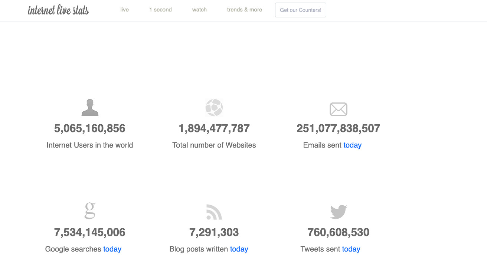

[](https://git.io/typing-svg)

<p align="center">
  <a href="https://github.com/GowthamGoush" target="_blank">
    
 </a>
  <a href="https://github.com/GowthamGoush" target="_blank">
    
 </a>
  <a href="https://github.com/GowthamGoush" target="_blank">
    
 </a>
</p>

<h3 align="center">A curated list of amazing websites</h3>

---

### How can I add a website?

1. Create an issue, with the title as website name, and in the description put a brief description of the website along with the link. 

2. Fork the project.

3. In the PREVIEWS folder, add the screenshot of your website with the following format: `WebsiteName_YourName.jpg`

4. Add the following to the `Readme.md` folder.

```markdown
- [website-name](Link to the website) - A brief description of that website
  <details>
    <summary>Preview</summary>
    
  </details>
```

**Note** : Please do not edit anything in `README.md` except your contribution part.

5. Create a Pull Request to add the changes to this Repository. Please change the title to `add website-name` and in the description add `resolve #issueNumber`.

---

### Jump to: [A](#a) | [B](#b) | [C](#c) | [D](#d) | [E](#e) | [F](#f) | [G](#g) | [H](#h) | [I](#i) | [J](#j) | [K](#k) | [L](#l) | [M](#m) | [N](#n) | [O](#o) | [P](#p) | [R](#r) | [S](#s) | [T](#t) | [U](#u) | [V](#v) | [W](#w) | [Y](#y) | [Z](#z)

---

## A
- [A Soft Murmur](https://asoftmurmur.com) - A customizable white-noise machine website.
  It provides five different nature sounds: rain, thunder, waves, wind, and fire. This website is useful to reduce distraction and to focus more on work, or relax.
  <details>
    <summary>Preview</summary>
    
  </details>

## B

## C
- [CSS-Tricks](https://css-tricks.com/) - Everything for CSS!
  Daily articles about CSS, HTML, JavaScript, and all things related to web design and development.
  <details>
    <summary>Preview</summary>
    
  </details>

## D
- [DSA_450](https://450dsa.com/) - If you're working on your DSA skills for interview prep, you would've definitely heard of [Love Babbar's curated list](https://drive.google.com/file/d/1FMdN_OCfOI0iAeDlqswCiC2DZzD4nPsb/view) of 450 problems. This website helps you to keep track of your progress.
  <details>
    <summary>Preview</summary>
    
  </details>

- [DEV](https://dev.to/) - A constructive and inclusive social network for software developers.
  <details>
    <summary>Preview</summary>
    
  </details>

## E
- [Emupedia](https://emupedia.net/beta/emuos/) - Simulates several retro operating systems for educational purposes
  <details>
    <summary>Preview</summary>
    
  </details>

## F
- [Free Rice](https://freerice.com/categories/english-vocabulary) - Answer triva questions to donate rice and help end world hunger!
  <details>
    <summary>Preview</summary>
    
  </details>

- [FutureMe](https://www.futureme.org/) - Send Emails to the future you
  <details>
    <summary>Preview</summary>
    
  </details>
  
## G
- [Gravity-Points](https://codepen.io/akm2/full/rHIsa) - The more gravity centers you plot, the more these forces will start to compete, making your screen all the more chaotic. And yes, your gravity points can absorb one another to create a black hole. It's outer space right there on your computer screen.
  <details>
    <summary>Preview</summary>
    
  </details>

## H
- [HowStuffWorks](https://www.howstuffworks.com/) - This website is dedicated entirely to -- you guessed it -- how things work. And by "things," they mean everything: from airbags to regenerative medicine to velocipede carousels. They've covered so much on this website, it'll be hard to run out of things to read about.
  <details>
    <summary>Preview</summary>
    
  </details>

- [Humans 3d character](https://humans.wannathis.one/) - This website is dedicated entirely to provide developers with 2d and 3d models to implement them in their projects.
  <details>
    <summary>Preview</summary>
    
  </details>

## I
- [interneting-is-hard](https://www.internetingishard.com/) - A html/css tutorial site for beginners to quickly learn.
  <details>
    <summary>Preview</summary>
    
  </details>
- [Internet Live Stats](https://www.internetlivestats.com/) - Watch the Internet as it grows in real time!
  <details>
    <summary>Preview</summary>
    
  </details>

## J
- [Jitter.Video](https://jitter.video/) - desiigners handy way for motion design, a website where you can create animations and Export them as a GIF or a video all in your browser, cool tool for future animated posts for any one's social media or any personal project.
  <details>
    <summary>Preview</summary>
    
  </details>
## K
- [kottke.org](https://kottke.org/) - One of the oldest blogs on the web. It covers the essential people, inventions, performances, and ideas that increase the collective adjacent possible of humanity – through the eyes of Jason Kottke.
  <details>
    <summary>Preview</summary>
    
  </details>

## L
- [Log2Base2](https://log2base2.com/) - Struggling to Learn programming, data structures & algorithms, and prepare for the interview, learn by visualizing the concepts.
  <details>
    <summary>Preview</summary>
    
  </details>

- [Learn x in y minutes]( https://learnxinyminutes.com/) - quickly grab programming language concepts. It is available in 23 languages.
  <details>
    <summary>Preview</summary>
    
  </details>

## M
- [MDN Web Docs](https://developer.mozilla.org/en-US/) - Official documentation repository for the web developers owned by Mozilla.
  <details>
    <summary>Preview</summary>
    
  </details>

## N

## O

## P

## Q

## R
- [radio.garden](http://radio.garden/visit/chennai/jKelPaRC) - Listen to radio around the world
  <details>
    <summary>Preview</summary>
    
  </details>
  
- [Roadmap](https://roadmap.sh/) - It is a community effort to create roadmaps, guides and other educational content to help guide the developers in picking up the path and guide their learnings.
  <details>
    <summary>Preview</summary>
    
  </details>

- [Regex101](https://regex101.com/) - Site to test regex with explanation, match information and regex reference.
  <details>
    <summary>Preview</summary>
    
  </details>

- [Replit](https://replit.com/) - Replit allows users to write code and build apps and websites using a browser. The site also has various collaborative features, including capability for real-time, multiuser editing with a live chat feed.
  <details>
    <summary>Preview</summary>
    
  </details>

## S

- [Smooth DOC](https://smooth-doc.com/) - Smooth DOC is a ready-to-use Gatsby theme to create a documentation website. Creating a pro-quality document website takes weeks. Smooth DOC saves you lot of time and lets you focus on the content.
  <details>
    <summary>Preview</summary>
    
  </details>

## T

## U

## V

- [visualgo](https://visualgo.net/en) - This visualizes famous algorithms and data structures through animation. The animation eases the understanding of algorithms and data structures.
  <details>
    <summary>Preview</summary>
    
  </details>

## W
- [WindowSwap](https://www.window-swap.com/) - Allows you to visit random windows around the world
  <details>
    <summary>Preview</summary>
    
  </details>

- [whoismrrobot](https://www.whoismrrobot.com/exit/) - This website consist of Exit Game played by Elliot Anderson in Famous T.V series Mr Robot ( season 4 ep 11 ) 
  <details>
    <summary>Preview</summary>
    
  </details>
## X

## Y

## Z
- [z-library](https://1lib.in/) - The world's largest ebook library
  <details>
    <summary>Preview</summary>
    
  </details>
