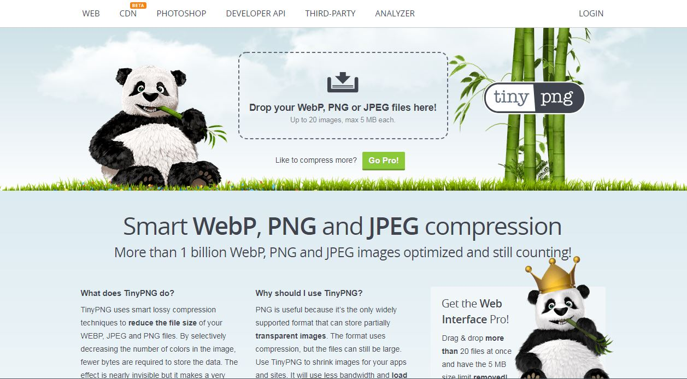
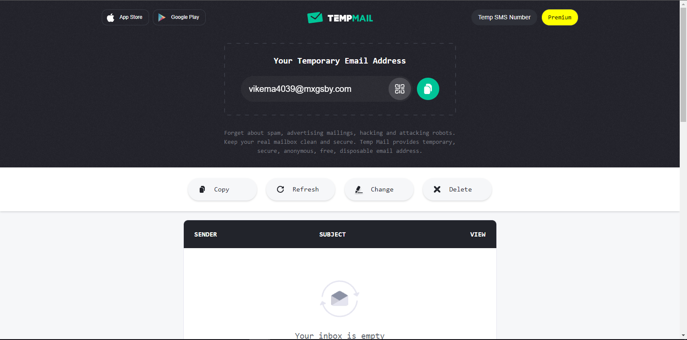
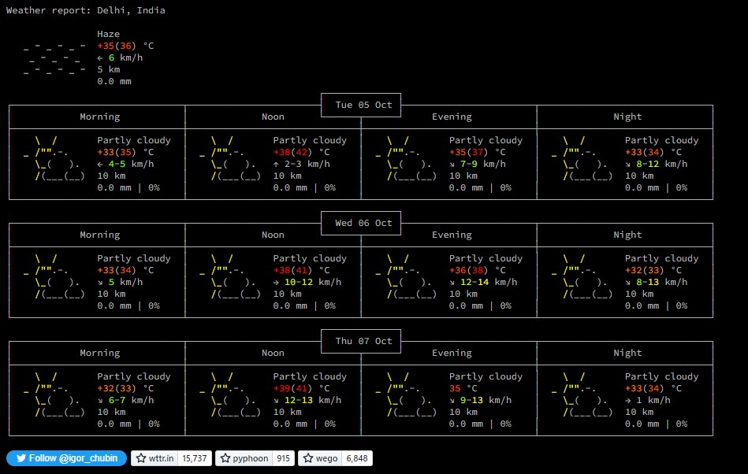
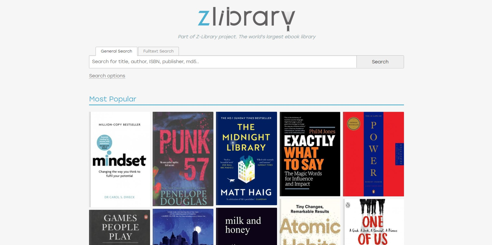

[](https://git.io/typing-svg)

<p align="center">
  <a href="https://github.com/GowthamGoush" target="_blank">
    
 </a>
  <a href="https://github.com/GowthamGoush" target="_blank">
    
 </a>
  <a href="https://github.com/GowthamGoush" target="_blank">
    
 </a>
</p>

<h3 align="center">A curated list of amazing websites</h3>

---

### How can I add a website?

1. Create an issue, with the title as website name, and in the description put a brief description of the website along with the link. 

2. Fork the project.

3. In the PREVIEWS folder, add the screenshot of your website with the following format: `WebsiteName_YourName.jpg`

4. Add the following to the `Readme.md` folder.

```markdown
- [website-name](Link to the website) - A brief description of that website
  <details>
    <summary>Preview</summary>
    
  </details>
```

**Note** : Please do not edit anything in `README.md` except your contribution part.

5. Create a Pull Request to add the changes to this Repository. Please change the title to `add website-name` and in the description add `resolve #issueNumber`.

---

### Jump to: [A](#a) | [B](#b) | [C](#c) | [D](#d) | [E](#e) | [F](#f) | [G](#g) | [H](#h) | [I](#i) | [J](#j) | [K](#k) | [L](#l) | [M](#m) | [N](#n) | [O](#o) | [P](#p) | [R](#r) | [S](#s) | [T](#t) | [U](#u) | [V](#v) | [W](#w) | [Y](#y) | [Z](#z)

---

## A
- [Archive](https://archive.is/) - Takes a permanent snapshot of a web page that will exist forever even if the original page is gone.
  <details>
    <summary>Preview</summary>
    
  </details>

- [asdf](https://asdf-vm.com/) - A command line interface tool that manage multiple runtime versions.
  <details>
    <summary>Preview</summary>
    
  </details>
  
- [A Soft Murmur](https://asoftmurmur.com) - A customizable white-noise machine website.
  It provides five different nature sounds: rain, thunder, waves, wind, and fire. This website is useful to reduce distraction and to focus more on work, or relax.
  <details>
    <summary>Preview</summary>
    
  </details>
  
- [Astronomy Picture of the Day](https://apod.nasa.gov/apod/astropix.html) - Discover a different image of our universe every day.
  <details>
    <summary>Preview</summary>
    
  </details>  
  
- [Atlas Obscura](https://www.atlasobscura.com/) - The definitive guide to the world’s hidden wonders.
  <details>
    <summary>Preview</summary>
    
  </details>  

- [Awwwards](https://www.awwwards.com/) - Awwwards is a professional web design and development competition site. It can be used to get inspirations and theme ideas for your projects from world's most innovative websites.
  <details>
    <summary>Preview</summary>
    
  </details>

## B
- [Bartleby](https://www.bartleby.com/) - Bartleby publishes classic literature, poetry, non-fiction and reference texts free of charge.
  <details>
    <summary>Preview</summary>
    
  </details>

- [Boil The Frog](http://boilthefrog.playlistmachinery.com/) - Create a playlist of songs that moves seamlessly from one artist to another according to Spotify's artist similarity algorithm. (Ex. Justin Bieber to Jimi Hendrix, Miley Cyrus to Miles Davis, The Carter Family to Rammstein). 
  <details>
    <summary>Preview</summary>
    
  </details>

## C
- [Canva](https://www.canva.com/en_in/) - Canva is a graphic design platform, used to create social media graphics, presentations, posters, documents and other visual content.
  <details>
    <summary>Preview</summary>
    
  <details>

- [Carbon](https://dreamy-ptolemy-eb4e80.netlify.app/) - Create and share beautiful images of your source code in any programming or scripting language.
  <details>
    <summary>Preview</summary>
    
  </details>
  
- [Checklist Design](https://www.checklist.design/) - A checklist for web developers to make your work assured and not miss any fundamental parts of the project.
  <details>
    <summary>Preview</summary>
    
  </details>

- [Code Chef](https://www.codechef.com/) - CodeChef is a platform to help programmers make it big in the world of algorithms, computer programming, and programming contests. It hosts three featured contests every month (Long Challenge, CookOff, LunchTime & Starters) and gives away prizes and goodies to the winners as encouragement.
  <details>
   <summary>Preview</summary>
    
  </details>

- [CodeSandbox](https://codesandbox.io/) - CodeSandbox is a sandbox for rapid Web development where the developers can get multiple templates and environments already set up for development and also makes collaboration easy.
  <details>
    <summary>Preview</summary>
    
  </details>

- [Coggle](https://coggle.it/) - Create full roadmap for your project and schemas.
  <details>
    <summary>Preview</summary>
    
  </details>
  
- [Conventional Commits](https://www.conventionalcommits.org/en/v1.0.0/) - A set of rules for creating an explicit commit history. (Ex. `docs: correct spelling of CHANGELOG`)
  <details>
    <summary>Preview</summary>
    
  </details>

- [CSS-Tricks](https://css-tricks.com/) - Everything for CSS!
  Daily articles about CSS, HTML, JavaScript, and all things related to web design and development.
  <details>
    <summary>Preview</summary>
    
  </details>
  
- [calligraphr](https://www.calligraphr.com/) - transform your handwriting into a real font.
  <details>
    <summary>Preview</summary>
    
  </details>
  
- [Codier](https://codier.io/) - This webiste provides challenges to improve frontend skills and free resources to learn them.
  <details>
    <summary>Preview</summary>
    
  </details>
  
- [C# Corner](https://www.c-sharpcorner.com/) - Community of Software and Data Developers, and also you can share the knowledge in the form of articles, blogs, videos etc.
  <details>
    <summary>Preview</summary>
    
  </details>

- [CODEFORCES](https://codeforces.com/) - Codeforces is one of the best platforms for competitive coding and is usually known for its short challenges/contests where programmers from every corner of the world participate.
  <details>
    <summary>Preview</summary>
    
  </details>

- [CodinGame](https://www.codingame.com/start) - This website is quite interesting. Users can play game with programming with increasingly difficult puzzles, to learn to code better with an online programming application supporting twenty-five programming languages, and to compete in multiplayer programming contests involving timed artificial intelligence, or code golf challenges.
  <details>
    <summary>Preview</summary>
    
  </details>

    
- [Crontab](https://crontab.guru/) - The quick and simple editor for cron schedule expressions. This site is very helpful, simple and quick way to form CRON Expression.
  <details>
    <summary>Preview</summary>
    
  </details>

- [CSSbuttons.io](http://cssbuttons.io/) - find perfect buttons for your project.
  <details>
    <summary>Preview</summary>
    
  </details>
    
## D
- [DSA_450](https://450dsa.com/) - If you're working on your DSA skills for interview prep, you would've definitely heard of [Love Babbar's curated list](https://drive.google.com/file/d/1FMdN_OCfOI0iAeDlqswCiC2DZzD4nPsb/view) of 450 problems. This website helps you to keep track of your progress.
  <details>
    <summary>Preview</summary>
    
  </details>

- [DEV](https://dev.to/) - A constructive and inclusive social network for software developers.
  <details>
    <summary>Preview</summary>
    
  </details>

- [Deep Learning](https://atcold.github.io/pytorch-Deep-Learning/) - An excellent website for deep learning enthusiasts which covers deep learning concepts starting from basics to advanced with implementations. It also supports multiple themes for better focus.
  <details>
    <summary>Preview</summary>
    
  </details>  


- [Distro Test](https://distrotest.net/index.php) - DistroTest is a web service that allows you to test Linux and Unix operating systems online for free, without having to install them locally.
  <details>
    <summary>Preview</summary>
    
  </details>

## E
- [edX](https://www.edx.org/) - edX is one of the world’s leading MOOC platforms. MOOCs (massive open online courses) are offered for free to anyone wishing to learn.
  <details>
    <summary>Preview</summary>
    
  </details>
    
- [edabit](https://edabit.com/challenges) - edabit is a learning platform to learn coding and solve interactive challenges. Gain XP, unlock achievements and level up.
  <details>
    <summary>Preview</summary>
    
  </details>
    
- [Elements of AI](https://www.elementsofai.com/) - Free online AI courses that combine theory with practical exercises that you can complete at your own pace.
  <details>
    <summary>Preview</summary>
    
  </details>
- [Emupedia](https://emupedia.net/beta/emuos/) - Simulates several retro operating systems for educational purposes
  <details>
    <summary>Preview</summary>
    
  </details>
- [Exchange Rate Calculator](https://samarthraj11.github.io/Basic-Projects/exchangeRateCalculator/) - This calculates the real-time exchange value of currencies by making API calls.
  <details>
    <summary>Preview</summary>
    
  </details>

## F
- [Favicon Generator](https://www.favicon-generator.org/) - Easily create and edit favicons.
  <details>
    <summary>Preview</summary>
    
  </details>  
  
- [Free Rice](https://freerice.com/categories/english-vocabulary) - Answer triva questions to donate rice and help end world hunger!
  <details>
    <summary>Preview</summary>
    
  </details>

- [FutureMe](https://www.futureme.org/) - Send Emails to the future you
  <details>
    <summary>Preview</summary>
    
  </details>

- [FlatUIColor](https://flatuicolors.com/) - Helps you to select best UI colors
   2 features 13 more color palettes. Collaborating with 13 designers around the world, a total set of 280 colors are on your command 
  <details>
    <summary>Preview</summary>
    
  </details>
    
- [FreeCodeCamp](https://www.freecodecamp.org/) - Learn to code for free, build projects, earn certifications. FreeCodeCamp is a non-profit organization that consists of an interactive learning web platform, an online community forum, chat rooms, online publications and local organizations that intend to make learning web development accessible to anyone
  <details>
    <summary>Preview</summary>
    
  </details>

- [Frontend Mentor](https://www.frontendmentor.io/) - Solve real-world HTML, CSS and JavaScript challenges whilst working to professional designs. Join 228,004 developers building projects, reviewing code, and helping each other get better.
  <details>
    <summary>Preview</summary>
    
  </details>
  
## G
- [GeeksForGeeks](https://geeksforgeeks.org) - This website has the great resources to learn programming languages, Web-Development, App-Development, etc. You can also get the interview experiences of various companies on this website. They also have great DSA & interview preparation courses. And on top of that, they also have courses & free materials (MCQs , topic-explanatory blogs) for competitive exams like GATE. And overall it is a great website to help you to launch your career in Software Engineering.
  <details>
    <summary>Preview</summary>
    
  </details>

- [Gravity-Points](https://codepen.io/akm2/full/rHIsa) - The more gravity centers you plot, the more these forces will start to compete, making your screen all the more chaotic. And yes, your gravity points can absorb one another to create a black hole. It's outer space right there on your computer screen.
  <details>
    <summary>Preview</summary>
    
  </details>

## H

- [HackerNews](https://news.ycombinator.com/) - Hacker News (sometimes abbreviated as HN) is a social news website focusing on computer science and entrepreneurship. The word hacker in "Hacker News" refers to the hacker culture which consists of people who enjoy tinkering with technology and hence, the content's focus here is on technology. It is owned by "Y Combinator".
  <details>
    <summary>Preview</summary>
    
  </details>

- [Hackerrank](https://www.hackerrank.com/) - Hackerank is a learning platform. It provides a platform to get knowledge about several skills. It also provides free certification and interview preparation kit.
  <details>
    <summary>Preview</summary>
    
  </details>

- [HowStuffWorks](https://www.howstuffworks.com/) - This website is dedicated entirely to -- you guessed it -- how things work. And by "things," they mean everything: from airbags to regenerative medicine to velocipede carousels. They've covered so much on this website, it'll be hard to run out of things to read about.
  <details>
    <summary>Preview</summary>
    
  </details>

- [Humans 3d character](https://humans.wannathis.one/) - This website is dedicated entirely to provide developers with 2d and 3d models to implement them in their projects.
  <details>
    <summary>Preview</summary>
    
  </details>

- [Heikei](https://haikei.app/) - Heikei is a web-based app that generates SVGs and background patterns. They can be used in a design project or with CSS. It comes with a set of pre-made designs which a user can edit as per their needs.
  <details>
    <summary>Preview</summary>
    
  </details>
  
- [Hacker Typer](https://hackertyper.com/) - Want to feel like you’re in The Matrix? Or at least feel like a super cool computer hacker trying to break into some evil lair? Just open up this site and pound the keyboard away
  <details>
    <summary>Preview</summary>
    
  </details>

## I
- [IconScout](https://iconscout.com/) - Curated SVGs, Vector Icons, Illustrations, 3D graphics, and Lottie Animations. Over 4000+ new assets added every day. Integrated plugins, tools, editors, and more.
  <details>
    <summary>Preview</summary>
    
  </details>

- [Instructables](https://www.instructables.com/) - A community for people who like to build things.
  <details>
    <summary>Preview</summary>
    
  </details>

- [interneting-is-hard](https://www.internetingishard.com/) - A html/css tutorial site for beginners to quickly learn.
  <details>
    <summary>Preview</summary>
    
  </details>

- [Internet Live Stats](https://www.internetlivestats.com/) - Watch the Internet as it grows in real time!
  <details>
    <summary>Preview</summary>
    
  </details>
  
- [Itch.io](https://itch.io/) - An open marketplace for independent digital creators with a focus on independent video games.
  <details>
    <summary>Preview</summary>
    
  </details>

## J
- [Jitter.Video](https://jitter.video/) - desiigners handy way for motion design, a website where you can create animations and Export them as a GIF or a video all in your browser, cool tool for future animated posts for any one's social media or any personal project.
  <details>
    <summary>Preview</summary>
    
  </details>
  
- [joshwcomeau](https://www.joshwcomeau.com/) - It helps you learn all the technologies listed below with amazing animation and live Interaction. Which makes understanding the concept very simple.
  <details>
    <summary>Preview</summary>
    
  </details>

- [javascript.info](https://javascript.info/) - It is an amazing website to learn modern javascript. The course is well explained. You can learn from basic to advance topics in JS
  <details>
    <summary>Preview</summary>
    
  </details>
  
## K
- [Khan Academy](https://www.khanacademy.org/) - Learn (almost) anything, for free!
  <details>
    <summary>Preview</summary>
    
  </details>
- [kottke.org](https://kottke.org/) - One of the oldest blogs on the web. It covers the essential people, inventions, performances, and ideas that increase the collective adjacent possible of humanity – through the eyes of Jason Kottke.
  <details>
    <summary>Preview</summary>
    
  </details>

## L
- [LMGTFY - Let Me Google That For You](https://lmgtfy.app) - Tired of people who ask you about stuff they can easily Google? Try this app.
  <details>
    <summary>Preview</summary>
    
  </details>
- [Log2Base2](https://log2base2.com/) - Struggling to Learn programming, data structures & algorithms, and prepare for the interview, learn by visualizing the concepts.
  <details>
    <summary>Preview</summary>
    
  </details>

- [Lipsum](https://www.lipsum.com/) - Generate lorem ipsum text for designers and developers
  <details>
  <summary>Preview</summary>
  
  </details>

  
- [Learn x in y minutes]( https://learnxinyminutes.com/) - quickly grab programming language concepts. It is available in 23 languages.
  <details>
    <summary>Preview</summary>
    
  </details>
- [Laracasts]( https://laracasts.com/) - Push your web development skills to the next level, through expert screencasts on Laravel, Vue, and so much more.
  <details>
    <summary>Preview</summary>
    
  </details>
- [Learn Anything](https://learn-anything.xyz) - A Platform for knowledge discovery that helps you understand any topic through the most efficient paths
  <details>
    <summary>Preview</summary>
    
  </details>

## M
- [MDN Web Docs](https://developer.mozilla.org/en-US/) - Official documentation repository for the web developers owned by Mozilla.
  <details>
    <summary>Preview</summary>
    
  </details>

- [MyFridgeFood](https://myfridgefood.com/) - On this site, you can check off the food you have in your fridge and it will generate a list of recipes you can make with them. It's handy for when you're stuck and don't know what to cook.
  <details>
    <summary>Preview</summary>
    
  </details>

- [Material.io](https://material.io/) -Material is an adaptable system of guidelines, components, and tools that support the best practices of user interface design. Backed by open-source code, Material streamlines collaboration between designers and developers, and helps teams quickly build beautiful products.Backed by google.
  <details>
    <summary>Preview</summary>
    
  </details>

## N

## O

## P
- [project-corona](https://swapnalshahil.github.io/project-corona/) - Track corona cases
  <details>
    <summary>Preview</summary>
    
  </details>
  
- [Project Euler](https://projecteuler.net/archives) - Series of challenging mathematical/computer programming problems.
  <details>
    <summary>Preview</summary>
    
  </details> 

- [Photopea](https://www.photopea.com/) - Photopea is an advanced image editor, alternative to Adobe Photoshop. It is a web-based raster and vector graphics editor used for image editing, making illustrations, web design, or converting between different image formats. It supports advanced image formats from other renowned photo editing softwares.
  <details>
    <summary>Preview</summary>
    
  </details>
  
- [PIXLR](https://pixlr.com/) - Pixlr is an Online Photo Editor that lets you edit photos and create great designs right in your browser for Free.
  <details>
    <summary>Preview</summary>
    
  </details>
  
## Q

## R
- [Rabbit Hole](https://blas.com/) - Top-quality summaries of some of the best books out there.
  <details>
    <summary>Preview</summary>
    
  </details>

- [radio.garden](http://radio.garden/visit/chennai/jKelPaRC) - Listen to radio around the world
  <details>
    <summary>Preview</summary>
    
  </details>
  
- [Roadmap](https://roadmap.sh/) - It is a community effort to create roadmaps, guides and other educational content to help guide the developers in picking up the path and guide their learnings.
  <details>
    <summary>Preview</summary>
    
  </details>

- [Regex101](https://regex101.com/) - Site to test regex with explanation, match information and regex reference.
  <details>
    <summary>Preview</summary>
    
  </details>

- [Replit](https://replit.com/) - Replit allows users to write code and build apps and websites using a browser. The site also has various collaborative features, including capability for real-time, multiuser editing with a live chat feed.
  <details>
    <summary>Preview</summary>
    
  </details>

- [Remove.bg](https://www.remove.bg/) - upload an image to remove its background
  <details>
    <summary>Preview</summary>
    
  </details>

## S

- [Scotch.io](https://scotch.io/) - Scotch.io is a web development blog discussing all things programming, development, web and life. Scotch.io provides high quality and easy to understand content for web developers.
  <details>
    <summary>Preview</summary>
    
  </details>

- [Smashing Magazine](https://www.smashingmagazine.com/) - Smashing magazine is a site which delivers useful and innovative information of articles with the latest and current trends in web development.
  <details>
    <summary>Preview</summary>
    
  </details>

- [Smooth DOC](https://smooth-doc.com/) - Smooth DOC is a ready-to-use Gatsby theme to create a documentation website. Creating a pro-quality document website takes weeks. Smooth DOC saves you lot of time and lets you focus on the content.
  <details>
    <summary>Preview</summary>
    
  </details>

- [Software Library: MS-DOS Games](https://archive.org/details/softwarelibrary_msdos_games) - Play classic MS-DOS games straight in your web browser.
  <details>
    <summary>Preview</summary>
    
  </details>

- [Sound Of Colleagues](https://soundofcolleagues.com/#) - This website emulates the sound and ambiance of a workplace or an office, with fully customizable user experience. The motivation for this website comes from the fact that many people have been forced to work from home and miss the environment of an office.
  <details>
    <summary>Preview</summary>
    
  </details>
  
- [Stellarium](https://stellarium-web.org/) - Check out the stars, planets and constellations that are visible tonight.
  <details>
    <summary>Preview</summary>
    
  </details>

- [StudyTogether](https://www.studytogether.com/) - It is a community and a virtual Study Space-- available always and from everywhere. 24 x 7 live with learners from all around the globe.
  <details>
    <summary>Preview</summary>
    
  </details>

- [Submarine Cable Map](https://www.submarinecablemap.com/) - A comprehensive and regularly updated interactive map of the world's major submarine cable systems and landing stations. It is regularly updated by TeleGeography.
  <details>
    <summary>Preview</summary>
    
  </details>
  
  - [Swipwire the Tech Forum](https://swipwire.com/) - Trendy and new tech discussion forum for all tech lover. Any one can contribute with site and can get traffics and free backlinks.
  <details>
    <summary>Preview</summary>
    
  </details>

- [Statmethods.io](https://www.statmethods.net/) - it is a great site for beginners to learn R language and statistics.
  <details>
    <summary>Preview</summary>
    
  </details>

## T
- [Teach Yourself Computer Science](https://teachyourselfcs.com/) - Some of the best resources out there to teach yourself computer science.
  <details>
    <summary>Preview</summary>
    
  </details>
  
- [TinEye](https://tineye.com/) is a reverse image search engine. You can submit an image to TinEye to find out where it came from, how it is being used, if modified versions of the image exist, or to find higher resolution versions. TinEye uses image recognition technology rather than keywords, metadata or watermarks.
  <details>
    <summary>Preview</summary>
    
  </details>

- [TinyPNG](https://tinypng.com/) - TinyPNG uses smart lossy compression techniques to reduce the file size of your WEBP, JPEG and PNG files. By selectively decreasing the number of colors in the image, fewer bytes are required to store the data. The effect is nearly invisible but it makes a very large difference in file size.
  <details>
    <summary>Preview</summary>
    
  </details>

- [Temp Mail](https://temp-mail.org/en/) - Its is a free disposable email service that allows receiving email at a temporary address that self-destructed after a certain time elapses. It is also known by names like : tempmail, 10minutemail, 10minmail, throwaway email, fake-mail , fake email generator, burner mail or trash-mail.
  <details>
    <summary>Preview</summary>
    
  </details>
    
- [The Free Learning List](https://freelearninglist.org) - Internet's Best educational resources at one place; an initiative of the school thought.org
  <details>
    <summary>Preview</summary>
    
  </details>
    
- [30 Days Coding](https://www.30dayscoding.com/) - This is one of the best coding site where you can find DSA roadmaps, developer roadmaps , DSA guide, resume guide, templates and much more.
  <details>
    <summary>Preview</summary>
    
  </details>    
    
## U

- [Unicode Character Table](https://unicode-table.com/en/) - Unicode is a computing standard for the consistent encoding symbols. This website unicode-table contain everything related to Unicode encoding, encoding of every emoji, international languages, symbols, fancy letters, etc. It's very helpful as Unicode encoding and UTF-8 are very similar. 
  <details>
    <summary>Preview</summary>
    
  </details>

## V
    
- [Virustotal](https://www.virustotal.com/) - Virus Total is an online service that analyzes suspicious files and URLs to detect types of malware and malicious content using antivirus engines and website scanners.
  <details>
    <summary>Preview</summary>
    
  </details>

- [visualgo](https://visualgo.net/en) - This visualizes famous algorithms and data structures through animation. The animation eases the understanding of algorithms and data structures.
  <details>
    <summary>Preview</summary>
    
  </details>

- [Vector Magic](https://vectormagic.com/) - Vector Magic is an online and desktop software program designed to convert JPG and PNG images to fully functional SVGs or PDFs with speed and ease. Using the original bitmap, Vector Magic accurately traces out the graphic to generate a suitable vectorization.
  <details>
    <summary>Preview</summary>
    
  </details>

## W

- [Wayback Machine](https://archive.org/web/) - Explore billions of web pages saved over time.
  <details>
    <summary>Preview</summary>
    
  </details>
  
- [WindowSwap](https://www.window-swap.com/) - Allows you to visit random windows around the world
  <details>
    <summary>Preview</summary>
    
  </details>

- [whoismrrobot](https://www.whoismrrobot.com/exit/) - This website consist of Exit Game played by Elliot Anderson in Famous T.V series Mr Robot ( season 4 ep 11 ) 
  <details>
    <summary>Preview</summary>
    
  </details>
    
- [wickedbackgrounds](https://wickedbackgrounds.com) - Create beautiful SVG backgrounds for your UI designs. 
  <details>
    <summary>Preview</summary>
    
  </details>   
  
- [wttr](https://wttr.in/) - Provides Terminal Weather Forecast 
  <details>
    <summary>Preview</summary>
    
  </details>

- [W3Schools](https://www.w3schools.com/) - One of the best websites to learn through documentation. It provides clear and understandable texts and practice problems.
  <details>
    <summary>Preview</summary>
    
  </details>

## X

## Y

## Z
- [z-library](https://1lib.in/) - The world's largest ebook library
  <details>
    <summary>Preview</summary>
    
  </details>
